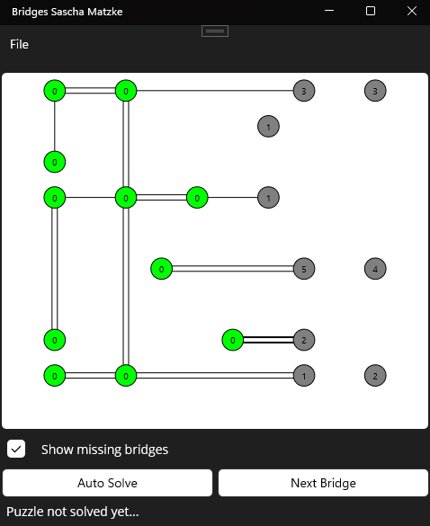

# Bridges
Hashiwokakero or Bridges is a logic puzzle originating in Japan.

The programming of the game in Java was our task while studying computer science at the FernUniversität in Hagen.

Islands are placed on a grid. These islands can be connected by horizontal or vertical bridges with player clicks.
Each island can have a single or a double bridge into each direction if there is an adjacent island and no other bridge crossing.
This means, an island can have up to 8 bridges maximum, two into each direction.
A bridge or double bridge can be set by left-click next to an island into the direction of choice. A bridge can be unset by right-click.
The game is won when the target number of bridges for each single island is met and all islands are connected directly or indirectly.
The target number is shown inside each island. This can be switched to show only the remaining bridges with a checkbox.
The bridges between the islands for the solution and thereby the target numbers for the islands are randomly determined in the game creation process.

This repository contains the implementation as a .NET MAUI Windows app (language C#).

Subtasks that were implemented in this case:
- Creation of the GUI.
- Drawing of islands and bridges in the field with the usage of coordinates. Adjusting the coordinate system when the field is dragged larger or smaller.
- Processing of clicks into the field: Which direction of which island is affected by the click on a specific coordinate? Is there a neighbor? Can this neighbor take another bridge? Does the new bridge not cross existing bridges (forbidden)?
- A "Create Game" dialogue, which lets the user the choice to select the field size and island count within specific limits and then generates a new game that has a solution.
- "Load Game", "Save Game" and "Reset Game" options.
- Help when the player is stuck. This sets the next bridge that can be determined by logical checks. This is not always possible depending on the game state.
- Updating and showing the current game state at the bottom of the window.
	- When the game is solved the status shows "Great! Puzzle solved!".
	- When the game is not solved yet and any bridge can be set (not neccessarily one that makes sense), this status shows "Puzzle not solved yet...".
	- Otherwise a dead end has been reached and the status shows "No further bridge can be added in the current state, try another approach!".

A bridge must always have a minimum length of 2. Additionally i have resticted the max length to field-width * field-height / island-count.
Otherwise in bigger fields with many islands the game creation process will run into problems because there will not be enough space to accommodate all the islands and their connections.

Comments on the different classes will be added soon!

